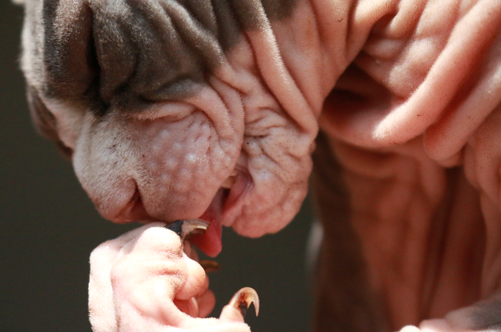
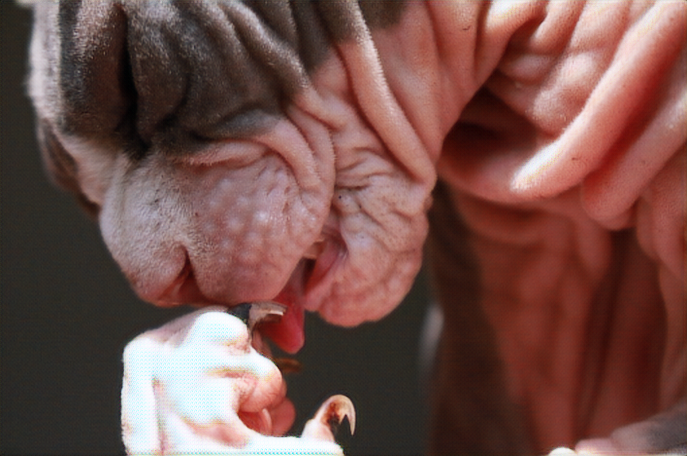
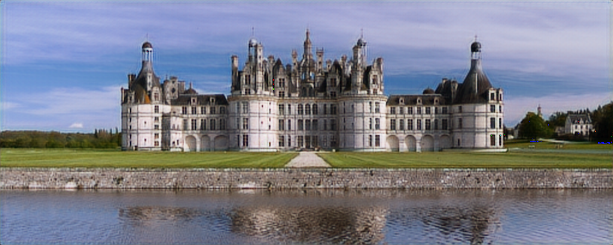

# super-resolution-pytorch

PyTorch implementation of the paper [Photo-Realistic Single Image Super-Resolution Using a Generative Adversarial Network](https://arxiv.org/abs/1609.04802) 

## 1. Data
In this repo, I used the [DIV2K dataset](https://data.vision.ee.ethz.ch/cvl/), which includes: 

- 1600 training images:
    - 800 high resolution (HR) images (2K)
    - 800 respective low resolution images (LR, 4x downscale)

- 400 test images:
    - 200 HR
    - 200 LR

## 2. Repo structure

```
.
├── CONFIG.py
├── DIV2K
│   ├── DIV2K_train_HR
│   ├── DIV2K_train_LR_bicubic
│   │   └── X4
│   ├── DIV2K_valid_HR
│   └── DIV2K_valid_LR_bicubic
│       └── X4
├── README.md
├── examples
├── requirements.txt
├── setup_remote.sh
├── src
│   ├── dataset.py
│   ├── discriminator.py
│   ├── evaluate.py
│   ├── gen_sr.py
│   ├── generator.py
│   ├── loss.py
│   └── train.py
└── unit_tests
    ├── test_dataloader.py
    ├── test_discriminator.py
    └── test_generator.py
```

- `CONFIG.py`: configurations for data, models and training.
- `DIV2K`: consists of our data:
    - `DIV2K_train_HR`: 800 HR training images
    - `DIV2K_train_LR_bicubic/X4`: 800 LR training images
    - `DIV2K_valid_HR`: 200 HR test images
    - `DIV2K_valid_LR_bicubic/X4`: 200 LR test images
- `setup_remote.sh`: You can setup this repo (including data download, python package installation, etc.) on your local machine or a remote server (Colab recommended) for faster training by executing the bash commands in this file.
- `examples`: contains some results on the test dataset.
- `src`:
    - `dataset.py`: custom torch dataset for DIV2K
    - `loss.py`: loss functions for generator
    - `train.py`: training script
    - `evaluate.py`: evaluating script
    - `gen_sr.py`: inference script for input images
- `unit_tests:` contains unit tests for data loader, generator and discriminator.

## 3. Usage
```commandline
cd src/
```

- Training:
```commandline
python train.py
```

- Evaluate:
```commandline
python evaluate.py
```

- Inference: 
```commandline
python gen_sr.py --filepath "path_to_your_image_file.png"
```

## 4. Results

| Original High Resolution images      | GAN-Generated Super Resolution images |
| --------------------------- | --------------------------------- |
|       |        |
|       |        |
|       |        |
|       |        |
|       |        |
